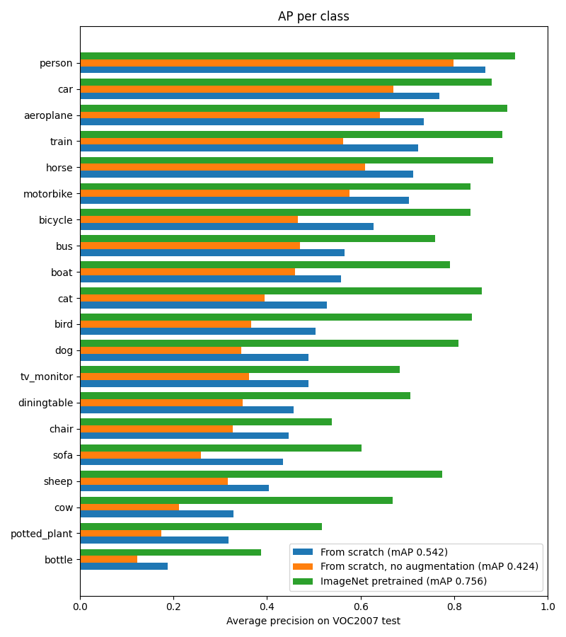
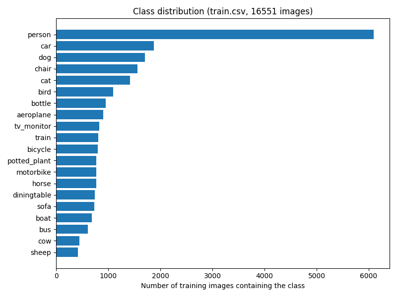
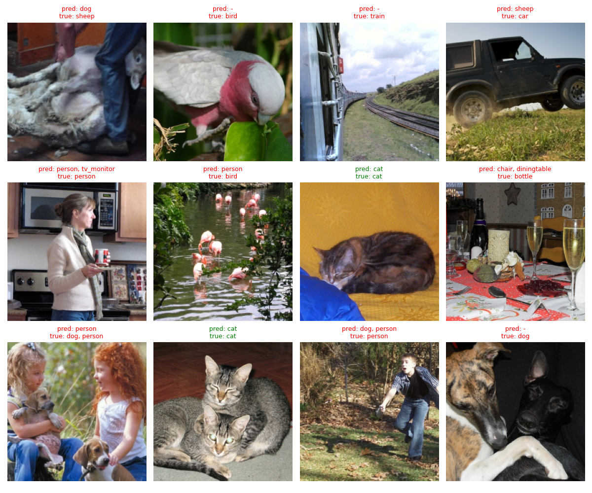
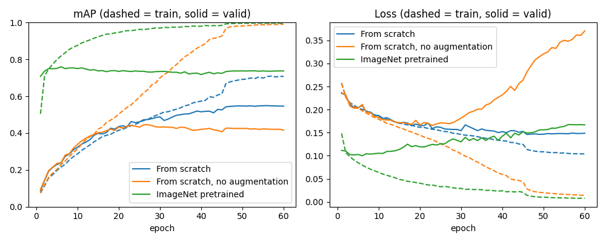

# AlexNet from Scratch on Pascal VOC

A PyTorch implementation of AlexNet ([Krizhevsky et al., 2012](https://papers.nips.cc/paper/2012/hash/c399862d3b9d6b76c8436e924a68c45b-Abstract.html)), trained **from scratch** (no ImageNet pretraining) for **multi-label image classification** on Pascal VOC. Each image can contain several of the 20 object classes, so the network predicts an independent probability per class.

**Test set result: 54.2% mAP** on the 4,952 images of VOC2007 test, trained from scratch. For comparison, the same training without data augmentation reaches 42.4%, and fine-tuning an ImageNet-pretrained AlexNet reaches 75.6% (see [Comparison runs](#comparison-runs)).

## Results

Results of the from-scratch model. Trained for 60 epochs on a single RTX 3060 Laptop GPU (about 30 seconds per epoch, ~30 minutes total).

| Metric (VOC2007 test, 4,952 images) | Score |
| --- | --- |
| mAP | **0.542** |
| F1 (sample-averaged) | 0.534 |
| Precision (sample-averaged) | 0.776 |
| Recall (sample-averaged) | 0.523 |
| Hamming loss | 0.050 |
| Exact match accuracy | 0.370 |

Predictions use a 0.5 threshold on the sigmoid outputs. mAP is the mean of per-class average precision computed with scikit-learn (non-interpolated, so not exactly the official VOC2007 11-point metric).

### Training curves


- Train and validation follow each other closely until about epoch 30, after that the model starts to overfit and the gap grows.
- The learning rate is divided by 10 at epoch 45, which gives the visible jump in both curves. After that validation mAP stays flat around 0.55.
- Best validation mAP was 0.549 (epoch 56), final was 0.546.

### Average precision per class





Classes that are common and usually large in the image (person, car, aeroplane) are the easiest. Bottle is the hardest class even though it has more training images than most classes, probably because bottles are usually small in the image and get lost after resizing to 227×227. Cow and sheep are the rarest classes and also look alike, so they score low too.

### Sample predictions

Twelve random test images (not hand-picked) from the from-scratch model. Green means the predicted set of labels is exactly right, red means at least one label is missing or extra.



Most mistakes are partial: the model finds the main object but misses a second one (dog next to people) or adds a related one (dining table for a table scene with bottles). Small or unusual views (a train seen from the window, a bird close-up) are often missed completely.

## Comparison runs

To see what matters most, I trained two more models with the same settings (60 epochs, same split and seed) and changed one thing each time:

- **No augmentation:** center crop only, no random crops or flips (`python train.py --no-aug`).
- **ImageNet pretrained:** torchvision's AlexNet with ImageNet weights, with the last layer replaced by a 20-class layer and the whole network fine-tuned (`python train.py --pretrained`). Note that torchvision's AlexNet is a slightly different version (64 filters in the first layer, no LRN).

| Run | Test mAP (last epoch) | Test mAP (best valid epoch) | F1 | Exact match |
| --- | --- | --- | --- | --- |
| From scratch | **0.542** | (best valid at epoch 56, ≈ last) | 0.534 | 0.370 |
| From scratch, no augmentation | 0.424 | 0.445 (epoch 27) | 0.478 | 0.289 |
| ImageNet pretrained | **0.756** | 0.768 (epoch 6) | 0.729 | 0.536 |

F1 and exact match are for the last epoch checkpoint.



- **Augmentation is worth about 12 mAP points.** Without it the model memorizes the training set (train mAP 0.99) while validation mAP peaks at epoch 27 and then goes down. Validation loss climbs from about 0.17 to 0.37.
- **Pretraining is worth about 21 mAP points.** 11k images are not enough to learn good features from scratch. The pretrained model reaches its best validation mAP after only 6 epochs and then slowly overfits, so 60 epochs is far too long for fine-tuning.
- Even the best run is far from modern models on VOC, which is expected for a 2012 architecture.

## Model

Input images are 227×227. The paper says 224, but with an 11×11 kernel and stride 4 only 227 gives the 55×55 feature map described in the paper.

| Layer | Configuration | Output |
| --- | --- | --- |
| Input | | 3 × 227 × 227 |
| Conv1 | 96 filters 11×11, stride 4, ReLU, LRN, max pool 3/2 | 96 × 27 × 27 |
| Conv2 | 256 filters 5×5, pad 2, ReLU, LRN, max pool 3/2 | 256 × 13 × 13 |
| Conv3 | 384 filters 3×3, pad 1, ReLU | 384 × 13 × 13 |
| Conv4 | 384 filters 3×3, pad 1, ReLU | 384 × 13 × 13 |
| Conv5 | 256 filters 3×3, pad 1, ReLU, max pool 3/2 | 256 × 6 × 6 |
| FC6 | Dropout 0.5, 9216 → 4096, ReLU | 4096 |
| FC7 | Dropout 0.5, 4096 → 4096, ReLU | 4096 |
| FC8 | 4096 → 20 | 20 |

58.4M parameters. The 20 outputs go through a sigmoid and are trained with binary cross entropy (one binary problem per class).

Differences from the paper:
- Trained on ~11k images instead of 1.2M ImageNet images, and for multi-label instead of single-label classification.
- Single GPU, so the convolutions are not split into two groups.
- Adam optimizer instead of SGD with momentum.
- Default PyTorch weight initialization instead of the paper's N(0, 0.01) weights and bias 1.
- Augmentation is random 227 crops from 256 and horizontal flips. No PCA color augmentation and no 10-crop testing.

## Dataset

Pascal VOC in YOLO label format, from Kaggle: [aladdinpersson/pascalvoc-yolo](https://www.kaggle.com/datasets/aladdinpersson/pascalvoc-yolo).

- **Train:** VOC2007 trainval + VOC2012 trainval, 16,551 images. Split randomly (seed 0) into 11,034 for training and 5,517 for validation.
- **Test:** VOC2007 test, 4,952 images.

Every label file lists the objects in the image (`class x y w h`). Only the class index is used, turned into a 20-dim multi-hot vector.

Download and extract it into `data/PascalVOC`:

```bash
mkdir -p data/PascalVOC
curl -L -o data/pascalvoc-yolo.zip https://www.kaggle.com/api/v1/datasets/download/aladdinpersson/pascalvoc-yolo
unzip -q data/pascalvoc-yolo.zip -d data/PascalVOC
rm data/pascalvoc-yolo.zip
```

```
data/PascalVOC/
├── images/       000005.jpg, ...
├── labels/       000005.txt, ...
├── train.csv     image,label pairs
└── test.csv
```

## Usage

Requires Python 3.10. With [uv](https://github.com/astral-sh/uv):

```bash
uv venv --python 3.10 .venv
uv pip install --python .venv/bin/python -r requirements.txt
source .venv/bin/activate
```

(or `pip install -r requirements.txt` in any Python 3.10 environment)

Train:

```bash
python train.py
python train.py --no-aug       # without random crop / flip
python train.py --pretrained   # fine-tune torchvision's ImageNet-pretrained AlexNet
```

Runs are reproducible: the model init, data shuffling, augmentation and train/validation split are all seeded. Hyperparameters are constants at the top of `train.py` (batch size 64, 60 epochs, Adam lr 1e-4, weight decay 5e-5, lr × 0.1 at epoch 45). A run saves (the variants add `_no-aug` or `_pretrained` to the name):
- `models/wdecay-5e-05_epoch-60`: checkpoint after the last epoch
- `models/wdecay-5e-05_epoch-60_best`: checkpoint from the epoch with the best validation mAP
- `log/wdecay-5e-05_epoch-60.json`: metrics for every epoch
- `plots/wdecay-5e-05_epoch-60.png`: loss and mAP curves

Evaluate on the test set (uses the checkpoint from `train.py` by default):

```bash
python test.py
python test.py models/wdecay-5e-05_epoch-60_best
```

It prints the metrics and the AP of every class, and saves them to `log/<checkpoint name>_test.json`.

Make the figures in this README (after training and testing the three runs):

```bash
python plot_results.py
```

Other scripts:
- `ut.py`: checks the model output shape and the dataset shapes, shows some training images with their labels
- `utils.py`: plots the class distribution of the train/validation split
- `overfit.py`: sanity check, trains a BatchNorm version of AlexNet on 16 images to see that it can memorize them

## Project structure

```
├── model.py      AlexNet (and the torchvision pretrained version)
├── dataset.py    PascalDataset, image transforms and multi-hot labels
├── train.py      training loop, validation, hyperparameters
├── test.py       evaluation on VOC2007 test
├── plot_results.py  figures for the README
├── utils.py      metrics (mAP, F1, ...) and class distribution plot
├── ut.py         shape checks and visualization
├── overfit.py    overfitting sanity check
└── plots/        figures
```

## References

- A. Krizhevsky, I. Sutskever, G. E. Hinton. *ImageNet Classification with Deep Convolutional Neural Networks.* NeurIPS 2012.
- M. Everingham et al. *The Pascal Visual Object Classes (VOC) Challenge.* IJCV 2010.

## License

MIT
